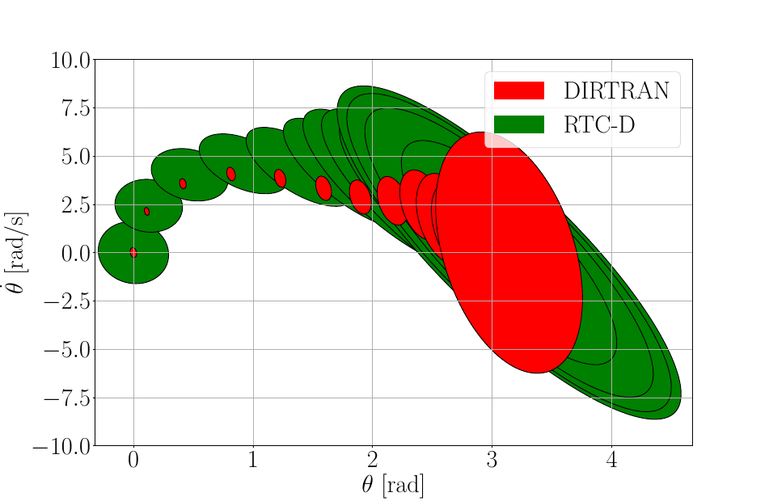
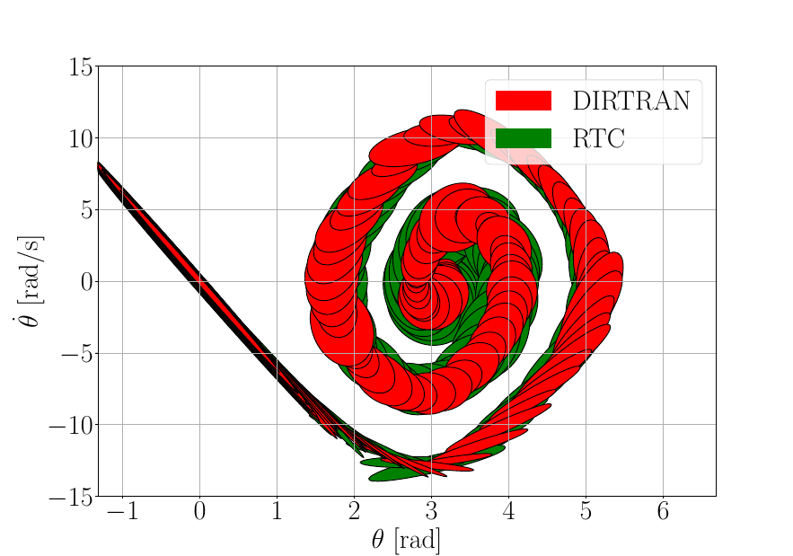
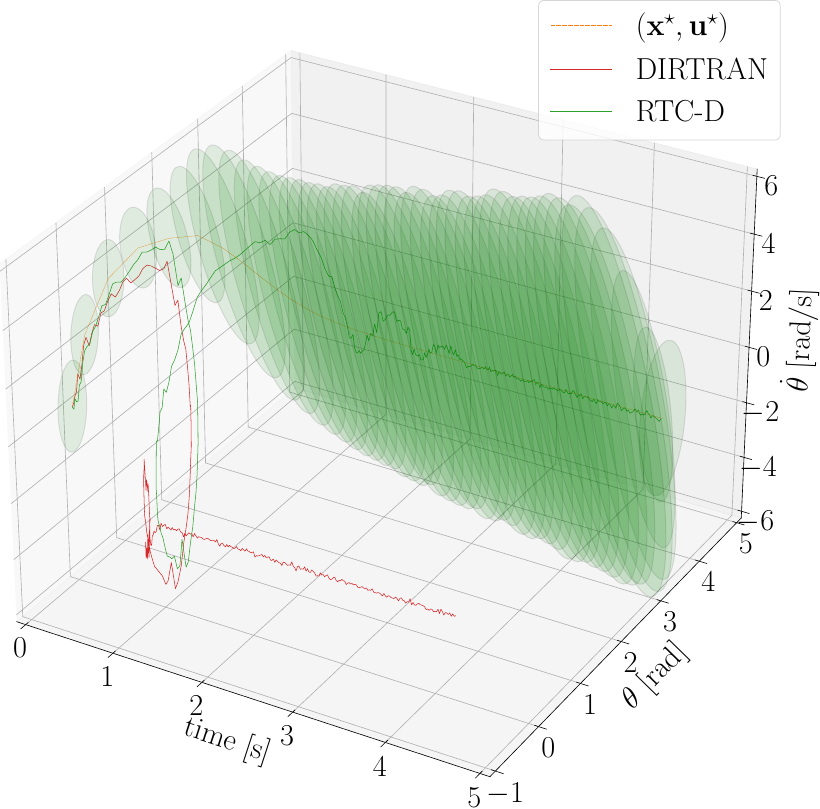
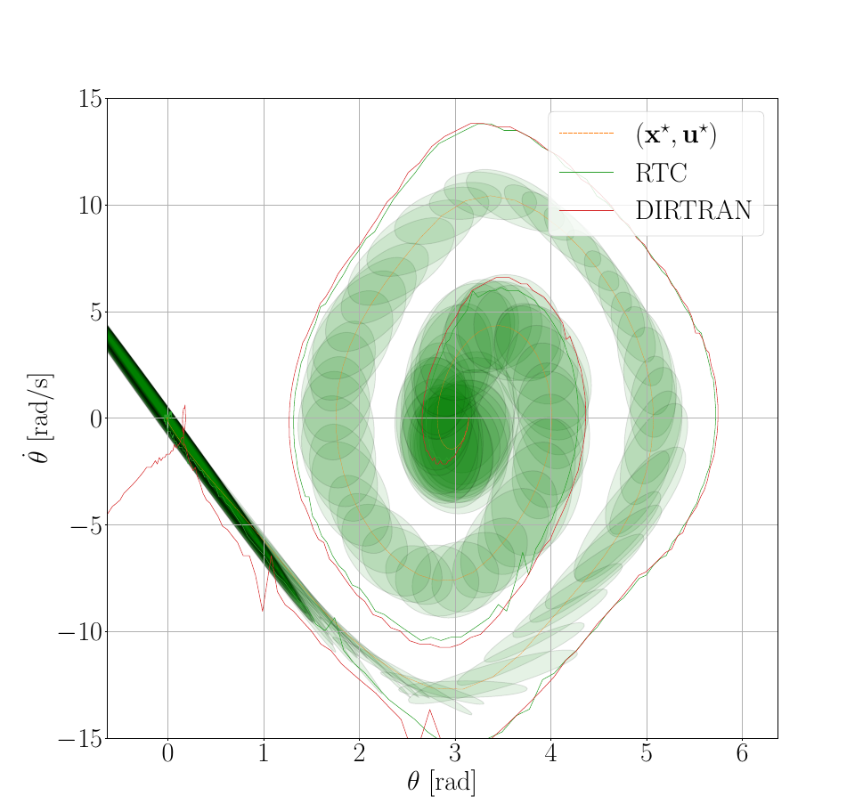

# Robust Co-Design of Canonical Underactuated Systems for Increased Certifiable Stability

This repository contains the code, data and plots of the paper "Robust Co-Design of Canonical Underactuated Systems for Increased Certifiable Stability". The paper has been submitted at the [ICRA 2024 Conference](https://2024.ieee-icra.org/). 

### Abstract
Optimal behaviours of a system to perform a specific task can be achieved by exploiting the coupling between trajectory optimization, stabilization and design optimization. This approach is particularly advantageous for underactuated systems, which are systems that have fewer actuators than degrees of freedom and thus require for more elaborate control systems. This paper proposes a novel co-design algorithm, namely Robust Trajectory Control with Design optimization (RTC-D). An inner optimization layer (RTC) simultaneously performs direct transcription (DIRTRAN) to find a nominal trajectory while computing optimal hyperparameters for a stabilizing time-varying linear quadratic regulator (TVLQR). RTC-D augments RTC with a design optimization layer. The system's robustness is maximized by considering a time-varying Lyapunov-based region of attraction (ROA) analysis. This analysis results with a formal guarantee of stabilizability for a set of off-nominal states. 

The proposed algorithms have been tested on two different underactuated systems: the torque-limited simple pendulum and the cart-pole. Extensive simulations of off-nominal initial conditions indicate improved robustness and real system experiments have shown an improved insensitivity to torque disturbances.

### Content
The scripts for generating the data and plots can be found in the [scripts](scripts) folder. The data and plots published in the paper are stored at [results/paper](results/paper). The source code for the acrobot dynamics, ROA computation, optimization and plotting is in the [src/coop](src/coop) folder.

### Installation
The requirements for the code can be installed with

    pip install -r requirements.txt

### Results

<!-- ### Citation
Maywald, Lasse & Wiebe, Felix & Kumar, Shivesh & Javadi, Mahdi & Kirchner, Frank. (2022). Co-optimization of Acrobot Design and Controller for Increased Certifiable Stability. 10.13140/RG.2.2.36436.07043.

    @misc{maywald2022,
    author = {Maywald, Lasse and Wiebe, Felix and Kumar, Shivesh and Javadi, Mahdi and Kirchner, Frank},
    year = {2022},
    month = {07},
    pages = {},
    title = {Co-optimization of Acrobot Design and Controller for Increased Certifiable Stability},
    doi = {10.13140/RG.2.2.36436.07043}
    } -->

  
  
  

